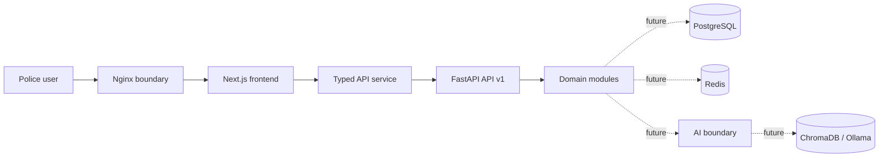

# PRAMAAN (ಪ್ರಮಾಣ)

Evidence • Intelligence • Justice

Production-oriented foundation for the Karnataka State Police – State Crime Records Bureau. Session 1 preserved the uploaded login portal and established the application shell. Session 2 adds the SCRB-aligned PostgreSQL model, SQLAlchemy/Pydantic data layer, repositories, Alembic baseline, proxy validation, resumable ETL, provenance, rejection handling, and database documentation. It deliberately contains no real authentication, AI, NL→SQL, dashboard, voice, analytics, or report logic.

## Architecture



Dependencies point inward: UI pages compose feature modules; feature modules use shared services and types; the HTTP layer invokes application/domain services; infrastructure adapters implement persistence and external integrations. Bounded contexts do not import each other's internals.

## Repository map

```text
app/                    Preserved Next.js App Router and workspace route
components/             Shared UI, providers, application shell, states
features/               Frontend feature boundaries (auth seam only)
services/ hooks/ types/ Shared frontend application contracts
theme/ constants/       Design tokens and stable application constants
backend/app/api/        Versioned FastAPI delivery layer
backend/app/core/       Configuration, logging, errors, middleware seams
backend/app/modules/    Domain bounded contexts (structure only)
backend/tests/          Backend verification
database/               Canonical schema, transformation SQL, migration entry
ai/                     AI capability boundaries—no implementation yet
docker/                 Reverse-proxy configuration
docs/                   Architecture and operating guidance
infrastructure/         Future environment deployment definitions
scripts/                Future idempotent operational tooling
.github/workflows/      Frontend and backend CI gates
```

The supplied Next.js package remains at the root so existing paths, assets, and visual implementation are not renamed. `frontend/README.md` records this compatibility decision.

## Technology decisions

- Next.js 16 is retained because it is the uploaded project version; App Router, React 19, TypeScript, Tailwind 4, and shadcn conventions remain intact.
- React Query provides server-state lifecycle; React Hook Form and Zod are installed for future typed forms without changing the login form.
- FastAPI + Pydantic Settings provide typed boundaries; SQLAlchemy, Alembic, Redis and JWT dependencies are present but unused until approved.
- PostgreSQL now uses the reviewed SCRB-aligned Session 2 schema; Redis and ChromaDB remain unimplemented integration seams.
- Feature folders own business-facing code; shared components contain visual primitives only.

## Local setup

Requirements: Node.js 22+, pnpm 10+, Python 3.11+, and optionally Docker Desktop.

```bash
cp .env.example .env.local
pnpm install
pnpm dev
```

Open `http://localhost:3000`. The frontend connects directly to Supabase using
the publishable key; Supabase Auth and row-level security authorize all reads.

Backend and database:

```bash
cd backend
python -m venv .venv
.venv/Scripts/activate
pip install -e ".[dev]"
alembic -c alembic.ini upgrade head
uvicorn app.main:app --reload
```

For a managed Supabase deployment, see [`docs/supabase_backend.md`](docs/supabase_backend.md).

Full local stack: `docker compose up --build`. Nginx listens on `http://localhost:8080`, frontend on `3000`, and the API on `8000`.

## Verification

```bash
pnpm lint
pnpm typecheck
pnpm test
pnpm build
cd backend
ruff check .
mypy app
pytest
cd ..
python scripts/validate_dataset.py C:\secure\fir_synthetic_data_50k_cleaned
```

Checklist:

- Login page markup, classes, assets, and styling are preserved.
- Successful mock verification reaches the responsive application shell.
- Loading, error, and empty states exist.
- Environment configuration contains no committed secrets.
- Backend `/health` and `/api/v1/health` respond without database access.
- CI enforces lint, types, tests, and production build.
- Auth, AI, LangGraph, NL→SQL and business pages remain absent.
- The proxy validation report contains no blocking structural errors and records incomplete proxy references as warnings.

## Future integration points

- Replace the login navigation seam with an identity provider adapter and server-managed secure session.
- Add permission-filtered navigation through the auth feature contract.
- Register domain routers in `backend/app/api/v1/router.py`; keep repositories behind interfaces.
- Add future schema changes only through reviewed Alembic revisions; never edit the applied baseline.
- Implement AI capabilities behind audited application services with citations, evaluation, access control, and human review.
- Add centralized logs, metrics, traces, secret management, WAF, backup, and disaster recovery per target environment.

Recommended commit message: `feat: establish PRAMAAN enterprise application foundation`
