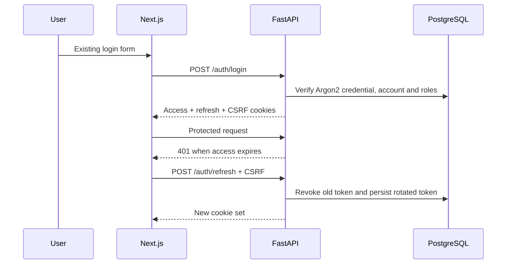

# Authentication

PRAMAAN accepts the existing portal identifier/credential pairs and issues a 10-minute access JWT plus a seven-day rotating refresh JWT. Both are `HttpOnly`, `Secure` in production, and `SameSite=Strict`; a readable CSRF cookie must match `X-CSRF-Token` on authenticated mutations.

Reuse of a rotated/revoked refresh token revokes its entire token family. Password changes, resets, deactivation and logout invalidate applicable sessions. Five failed attempts lock an account for 30 minutes by default.

Migration: `cd backend && alembic -c alembic.ini upgrade head`.
