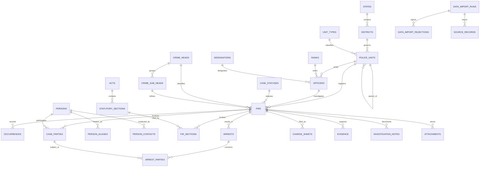

# Entity relationship diagram

```mermaid
erDiagram
  STATES ||--o{ DISTRICTS : contains
  DISTRICTS ||--o{ POLICE_UNITS : governs
  UNIT_TYPES ||--o{ POLICE_UNITS : classifies
  POLICE_UNITS ||--o{ POLICE_UNITS : parent_of
  POLICE_UNITS ||--o{ OFFICERS : posts
  RANKS ||--o{ OFFICERS : ranks
  DESIGNATIONS ||--o{ OFFICERS : designates
  POLICE_UNITS ||--o{ FIRS : registers
  OFFICERS ||--o{ FIRS : investigates
  CASE_STATUSES ||--o{ FIRS : statuses
  CRIME_HEADS ||--o{ CRIME_SUB_HEADS : groups
  CRIME_HEADS ||--o{ FIRS : classifies
  CRIME_SUB_HEADS ||--o{ FIRS : refines
  FIRS ||--o{ OCCURRENCES : records
  FIRS ||--o{ CASE_PARTIES : involves
  PERSONS ||--o{ CASE_PARTIES : participates
  PERSONS ||--o{ PERSON_ALIASES : known_as
  PERSONS ||--o{ PERSON_CONTACTS : contacted_by
  ACTS ||--o{ STATUTORY_SECTIONS : contains
  FIRS ||--o{ FIR_SECTIONS : invokes
  STATUTORY_SECTIONS ||--o{ FIR_SECTIONS : cited_by
  FIRS ||--o{ ARRESTS : results_in
  ARRESTS ||--o{ ARREST_PARTIES : concerns
  CASE_PARTIES ||--o{ ARREST_PARTIES : subject_of
  FIRS ||--o{ CHARGE_SHEETS : filed_as
  FIRS ||--o{ EVIDENCE : supports
  FIRS ||--o{ INVESTIGATION_NOTES : documents
  FIRS ||--o{ ATTACHMENTS : stores
  DATA_IMPORT_RUNS ||--o{ DATA_IMPORT_REJECTIONS : rejects
  DATA_IMPORT_RUNS ||--o{ SOURCE_RECORDS : traces
```
