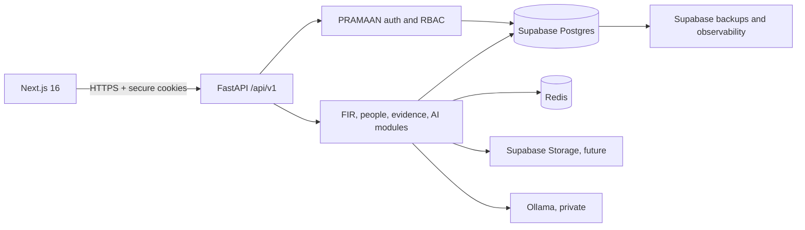

# Supabase backend architecture

## Decision

PRAMAAN should use Supabase as its managed PostgreSQL platform while retaining
FastAPI as the only public business API. The existing application contains
domain repositories, RBAC, rotating sessions, audit trails, import pipelines,
and guarded AI-to-SQL execution that do not map safely to direct browser CRUD.



The browser receives only `NEXT_PUBLIC_API_URL`. It must never receive a
Supabase secret or service-role key. Supabase's Data API remains inaccessible
to `anon` and `authenticated`; FastAPI connects through the pooler with a
database credential and performs authorization before repository access.

## Existing bounded contexts

| Layer | Responsibility |
|---|---|
| Next.js `app/`, `features/` | UI, protected routes, typed API calls |
| FastAPI `api/v1` | HTTP boundary, validation, security middleware |
| `modules/auth` | login, OTP seam, refresh rotation, RBAC |
| `repositories` and `models` | transactional domain persistence |
| `modules/ai` | validated read-only SQL workflow and audit |
| Supabase Postgres | FIR graph, people, evidence, governance, auth data |
| Redis | OTP challenges, rate limiting, transient coordination |

## Database domains

- Reference data: geography, police hierarchy, ranks, laws, courts, crime heads.
- Case data: FIRs, occurrences, sections, arrests, charge sheets.
- Investigation graph: persons, parties, aliases, contacts, addresses,
  organizations, vehicles, weapons, evidence, notes, attachments.
- Identity and governance: users, roles, permissions, sessions, login attempts,
  audit events, imports, provenance, rejections.
- AI governance: conversations, generated queries, execution audits.

## Deployment

Current project:

- Name: `pramaan`
- Project ref: `axxxkyrtmubtqtgjwfss`
- Region: Mumbai (`ap-south-1`)
- API URL: `https://axxxkyrtmubtqtgjwfss.supabase.co`

1. Create or select a Supabase project in an India-proximate approved region.
2. From **Connect**, copy the transaction-pooler URI and replace its scheme with
   `postgresql+asyncpg`. Add `?ssl=require`.
3. Set it as `PRAMAAN_DATABASE_URL` only in the FastAPI runtime secret store.
4. Apply the existing schema:

   ```powershell
   Set-Location backend
   alembic -c alembic.ini upgrade head
   ```

5. Apply
   `supabase/migrations/20260724000100_harden_fastapi_managed_database.sql`
   and `supabase/migrations/20260724000200_move_extensions_out_of_public.sql`.
6. Run backend tests and verify `/health`, `/api/v1/health`, login, FIR reads,
   and AI read-only queries.
7. Run Supabase Security and Performance Advisors after every DDL change.

## Security model

- All public tables have RLS enabled as defense in depth.
- `anon` and `authenticated` have no schema, table, sequence, or function
  privileges because direct Data API access is not part of this architecture.
- Authorization data stays in normalized `roles`, `permissions`, and join
  tables—not user-editable JWT metadata.
- FastAPI secrets and database credentials remain server-only.
- Attachments should move to a private Storage bucket later, using server-issued
  short-lived signed URLs and object paths scoped by FIR.
- Production should use network restrictions, SSL enforcement, short database
  credential rotation, PITR where required, and immutable audit export.

## Why Supabase Auth is not enabled in this migration

The current login contract supports mobile/OTP and PSN/PIN, account lockouts,
token-family revocation, CSRF protection, and government identity-provider
integration seams. Replacing it with Supabase Auth is a separate identity
migration—not a database hosting step—and would require an approved mapping
for PSN identities, OTP delivery, roles, and existing sessions.
